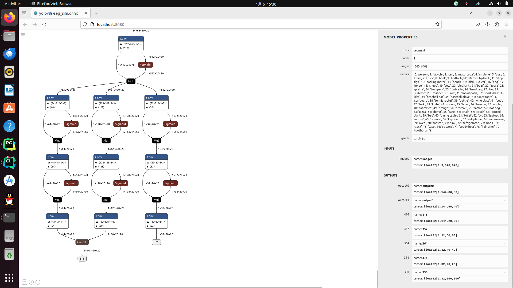

### 注意！导出分割模型前需要先参考 [检测模型](yolov8_native.md) 修改检测部分代码

修改 ultralytics/nn/modules/head.py class Segment(Detect):
```python
class Segment(Detect):
    """YOLOv8 Segment head for segmentation models."""

def __init__(self, nc=80, nm=32, npr=256, ch=()):
    """Initialize the YOLO model attributes such as the number of masks, prototypes, and the convolution layers."""
    super().__init__(nc, ch)
    self.nm = nm  # number of masks
    self.npr = npr  # number of protos
    self.proto = Proto(ch[0], self.npr, self.nm)  # protos
    self.detect = Detect.forward

    c4 = max(ch[0] // 4, self.nm)
    self.cv4 = nn.ModuleList(nn.Sequential(Conv(x, c4, 3), Conv(c4, c4, 3), nn.Conv2d(c4, self.nm, 1)) for x in ch)

def forward(self, x):
    """Return model outputs and mask coefficients if training, otherwise return outputs and mask coefficients."""
    p = self.proto(x[0])  # mask protos
    bs = p.shape[0]  # batch size

    mc = torch.cat([self.cv4[i](x[i]).view(bs, self.nm, -1) for i in range(self.nl)], 2)  # mask coefficients
    mc_ = [self.cv4[i](x[i]) for i in range(self.nl)]  # mask coefficients
    x = self.detect(self, x)
    if self.training:
        return x, mc, p
    # return (torch.cat([x, mc], 1), p) if self.export else (torch.cat([x[0], mc], 1), (x[1], mc, p))
    return (x, *mc_, p) if self.export else (torch.cat([x[0], mc], 1), (x[1], mc, p))
```
导出模型
```bash
yolo export model=yolov8s-seg.pt format=onnx
onnxsim yolov8s-seg.onnx yolov8s-seg_sim.onnx
```
