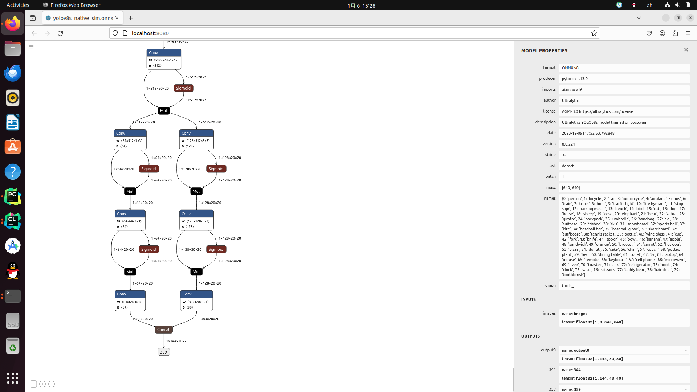

修改 ultralytics/nn/modules/head.py class Detect(nn.Module):
```python
    def forward(self, x):
        """Concatenates and returns predicted bounding boxes and class probabilities."""
        shape = x[0].shape  # BCHW
        for i in range(self.nl):
            x[i] = torch.cat((self.cv2[i](x[i]), self.cv3[i](x[i])), 1)
        if self.training:
            return x
        elif self.dynamic or self.shape != shape:
            self.anchors, self.strides = (x.transpose(0, 1) for x in make_anchors(x, self.stride, 0.5))
            self.shape = shape

        x_cat = torch.cat([xi.view(shape[0], self.no, -1) for xi in x], 2)
        if self.export and self.format in ('saved_model', 'pb', 'tflite', 'edgetpu', 'tfjs'):  # avoid TF FlexSplitV ops
            box = x_cat[:, :self.reg_max * 4]
            cls = x_cat[:, self.reg_max * 4:]
        else:
            box, cls = x_cat.split((self.reg_max * 4, self.nc), 1)
        dbox = dist2bbox(self.dfl(box), self.anchors.unsqueeze(0), xywh=True, dim=1) * self.strides
        # dbox = self.dfl(box)

        if self.export and self.format in ('tflite', 'edgetpu'):
            # Normalize xywh with image size to mitigate quantization error of TFLite integer models as done in YOLOv5:
            # https://github.com/ultralytics/yolov5/blob/0c8de3fca4a702f8ff5c435e67f378d1fce70243/models/tf.py#L307-L309
            # See this PR for details: https://github.com/ultralytics/ultralytics/pull/1695
            img_h = shape[2] * self.stride[0]
            img_w = shape[3] * self.stride[0]
            img_size = torch.tensor([img_w, img_h, img_w, img_h], device=dbox.device).reshape(1, 4, 1)
            dbox /= img_size
        # x = dbox
        # y = cls.sigmoid()
        y = torch.cat((dbox, cls.sigmoid()), 1)
        # return (y, x) if self.export else (y, x)
        # return y if self.export else (y, x)
        return x if self.export else (y, x)
```
导出模型
```bash
yolo export model=yolov8s.pt format=onnx
onnxsim yolov8s.onnx yolov8s_sim.onnx 
```
