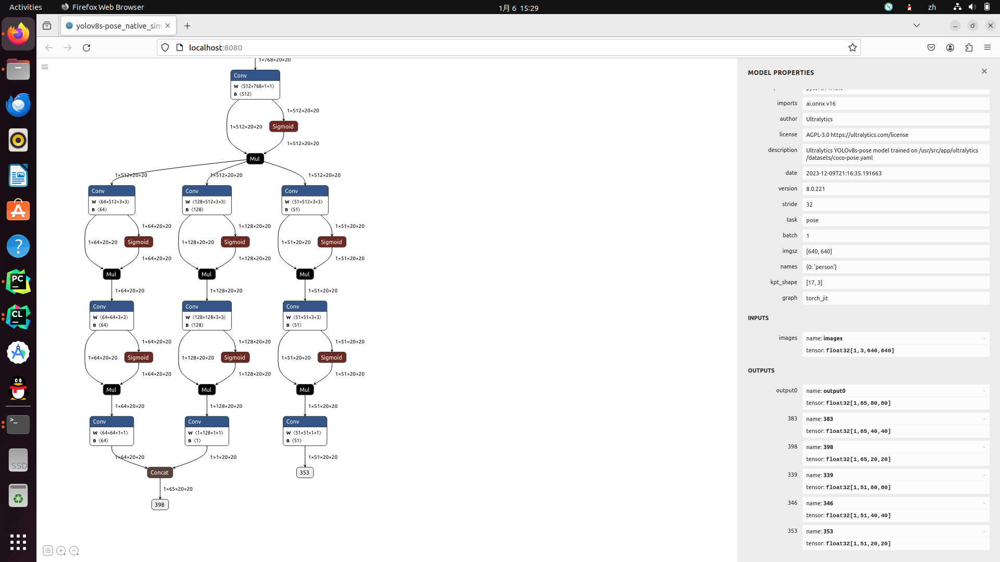

### 注意！导出姿态模型前需要先参考 [检测模型](yolov8_native.md) 修改检测部分代码

修改 ultralytics/nn/modules/head.py class Pose(Detect):
```python
class Pose(Detect):
    """YOLOv8 Pose head for keypoints models."""

    def __init__(self, nc=80, kpt_shape=(17, 3), ch=()):
        """Initialize YOLO network with default parameters and Convolutional Layers."""
        super().__init__(nc, ch)
        self.kpt_shape = kpt_shape  # number of keypoints, number of dims (2 for x,y or 3 for x,y,visible)
        self.nk = kpt_shape[0] * kpt_shape[1]  # number of keypoints total
        self.detect = Detect.forward

        c4 = max(ch[0] // 4, self.nk)
        self.cv4 = nn.ModuleList(nn.Sequential(Conv(x, c4, 3), Conv(c4, c4, 3), nn.Conv2d(c4, self.nk, 1)) for x in ch)

    def forward(self, x):
        """Perform forward pass through YOLO model and return predictions."""
        bs = x[0].shape[0]  # batch size
        kpt = torch.cat([self.cv4[i](x[i]).view(bs, self.nk, -1) for i in range(self.nl)], -1)  # (bs, 17*3, h*w)
        kpt_ = [self.cv4[i](x[i]) for i in range(self.nl)]
        x = self.detect(self, x)
        if self.training:
            return x, kpt
        pred_kpt = self.kpts_decode(bs, kpt)
        # return torch.cat([x, pred_kpt], 1) if self.export else (torch.cat([x[0], pred_kpt], 1), (x[1], kpt))
        return (x, *kpt_) if self.export else (torch.cat([x[0], pred_kpt], 1), (x[1], kpt))
```
导出模型
```bash
yolo export model=yolov8s-pose.pt format=onnx
onnxsim yolov8s-pose.onnx yolov8s-pose_sim.onnx
```
